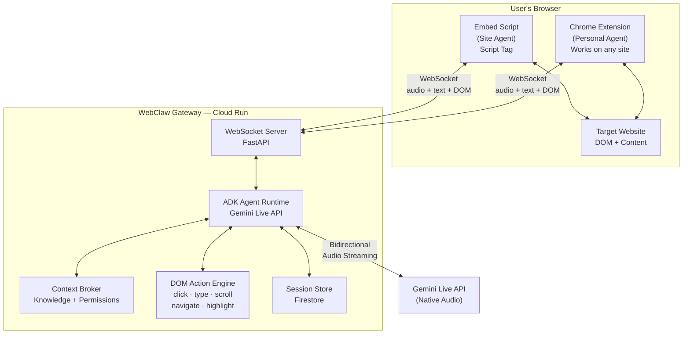
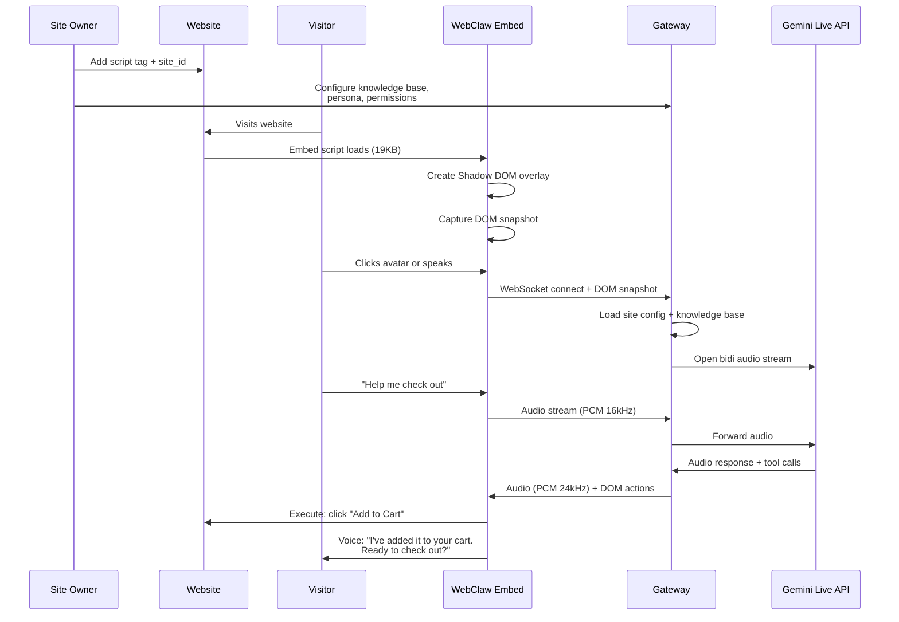
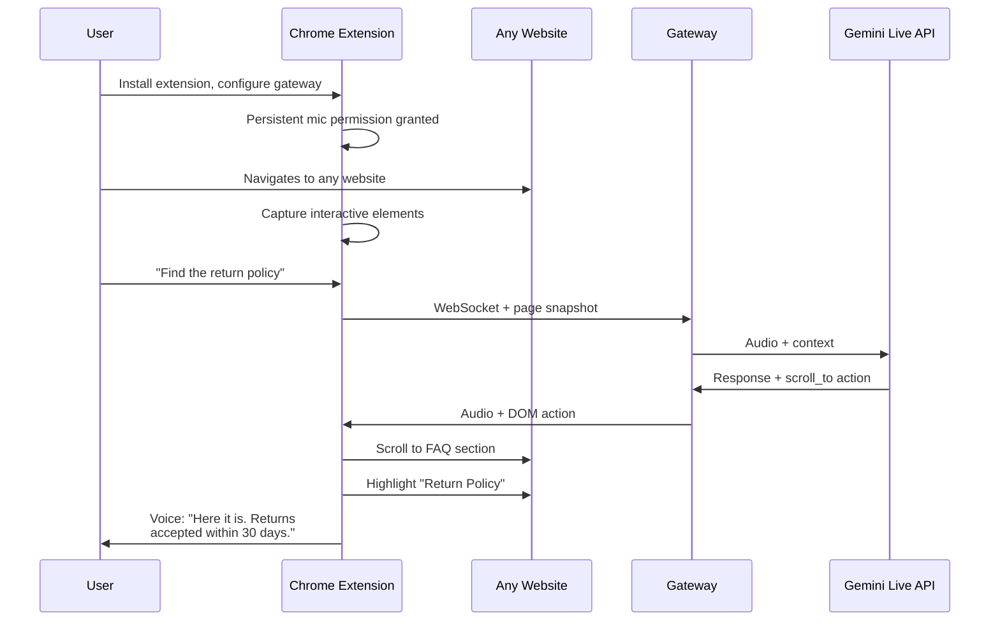
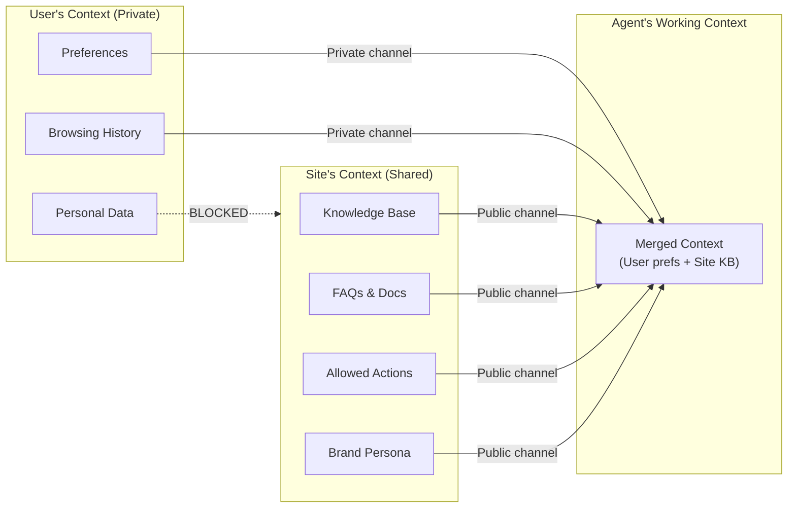

<div align="center">

# 🦀 WebClaw

### Personal Live Agent for Website Operations and Support

[](https://google.github.io/adk-docs/)
[](https://ai.google.dev/gemini-api/docs/live)
[](https://cloud.google.com/run)
[](LICENSE)

**What if every website had an intelligent, voice-enabled agent that could actually *do things* for you — not just answer questions into the void?**

[Quick Start](#-quick-start) · [Architecture](#-architecture) · [Demo](#-demo) · [Deploy](#-deploy-to-gcp) · [Challenge](#-challenge-entry)

</div>

---

## 🧠 What is WebClaw?

WebClaw is a **voice-first AI agent** that lives on websites. Unlike traditional chat widgets that serve canned responses, WebClaw can:

- **See the page** — understands DOM structure, layout, and content in real-time
- **Hear the user** — captures speech via microphone with real-time streaming
- **Speak back** — responds with natural voice through Gemini's native audio
- **Take actions** — clicks buttons, fills forms, navigates pages, highlights elements
- **Use knowledge** — answers questions using site-specific knowledge bases

It is not a chatbot. It is a **companion that operates the website alongside you**.

### The Problem WebClaw Solves

| Current State | With WebClaw |
|:---|:---|
| Chat widgets serve canned responses | Agent understands context and takes action |
| Users abandon carts, fail forms, can't find features | Agent guides users through workflows in real-time |
| Support staff can't see what users see | Agent sees the exact same page and can operate it |
| Every interaction starts from zero | Personal agent carries context across sites |
| Text-only, turn-based, disconnected | Voice-first, real-time, integrated with the page |

---

## 🏗 Architecture

WebClaw uses a **Gateway architecture** (not peer-to-peer) to provide privacy, security, and scalability. The Gateway brokers context between the site's knowledge base and the executing agent while enforcing asymmetric privacy: site knowledge flows to the agent, but user data stays private.



### Two Modes of Operation

WebClaw operates in two complementary modes, each serving a different use case:

#### Mode 1: Site Agent (Embed Script)

For **website owners** who want to add an intelligent agent to their site. Zero installation for visitors.



#### Mode 2: Personal Agent (Chrome Extension)

For **users** who want a personal AI assistant that travels with them across the web.



### Context Broker: Asymmetric Privacy

When a Personal Agent meets a Site Agent, the Gateway enforces **asymmetric context sharing**. The site's knowledge flows to help the user; the user's personal data never flows to the site.



---

## 🎭 The Avatar

WebClaw features an animated avatar built with Canvas 2D that provides visual feedback for every agent state:

| State | Visual | Behavior |
|:------|:-------|:---------|
| **Idle** | Gentle breathing, occasional blinks, subtle pulse | Agent is available and ready |
| **Listening** | Attentive eyes, blue glow ring pulsing | Microphone active, processing user speech |
| **Speaking** | Lip-synced mouth animation, green glow, gentle bounce | Agent is responding with voice |
| **Thinking** | Spinning arc indicator around head | Processing request, can still listen (barge-in) |
| **Acting** | Lightning bolt indicator ⚡ | Executing a DOM action on the page |

The avatar uses real audio analysis when connected to the Web Audio API for accurate lip sync, or falls back to simulated mouth movement driven by sinusoidal functions for natural-looking speech animation.

---

## 🛠 DOM Action Engine

WebClaw's agent can perform 8 categories of DOM operations, each implemented as a Gemini function-calling tool:

| Tool | Description | Example Use Case |
|:-----|:-----------|:----------------|
| `click_element` | Click buttons, links, tabs, menu items | "Add this to my cart" |
| `type_text` | Type into input fields and textareas | "Fill in my email address" |
| `scroll_to` | Scroll to elements or by pixel amount | "Show me the pricing section" |
| `navigate_to` | Navigate to URLs within the site | "Go to the contact page" |
| `highlight_element` | Draw attention with glow border + tooltip | "Where is the search bar?" |
| `read_page` | Extract text content from elements | "What does this section say?" |
| `select_option` | Choose from dropdowns and selects | "Select medium size" |
| `check_checkbox` | Toggle checkboxes | "Agree to terms and conditions" |

The action engine uses a **smart element finder** that tries three strategies in order:
1. **CSS selector** — direct DOM query
2. **ARIA label** — accessibility attribute matching
3. **Text content** — fuzzy matching against interactive elements (buttons, links, labels)

---

## 🚀 Quick Start

### Prerequisites

| Tool | Version | Purpose |
|:-----|:--------|:--------|
| Python | 3.10+ | Gateway backend |
| Node.js | 18+ | Embed script build |
| Gemini API Key | — | [Get one free](https://aistudio.google.com/apikey) |

### 1. Clone & Setup

```bash
git clone https://github.com/AfrexAI/webclaw.git
cd webclaw
```

### 2. Gateway Backend

```bash
cd gateway

# Create virtual environment
python -m venv .venv
source .venv/bin/activate  # macOS/Linux
# .venv\Scripts\activate   # Windows

# Install dependencies
pip install -r requirements.txt

# Configure
cp .env.example .env
# Edit .env → add your GOOGLE_API_KEY

# Run
uvicorn main:app --host 127.0.0.1 --port 8081
```

You should see:
```
INFO:     Application startup complete.
INFO:     Uvicorn running on http://127.0.0.1:8081
```

Verify with:
```bash
curl http://127.0.0.1:8081/health
# → {"status":"ok","service":"webclaw-gateway"}

curl http://127.0.0.1:8081/api/sites
# → {"sites":[{"site_id":"demo","domain":"localhost",...}]}
```

### 3. Embed Script

```bash
cd embed
npm install
npm run build
# → dist/webclaw.js  19.6kb ⚡ Done in 2ms
```

### 4. Demo Site

Open the demo e-commerce site in your browser:

```bash
open demo-site/index.html
# Or: python -m http.server 3000 -d demo-site
```

The TechByte Store demo includes:
- 6 product cards with Add to Cart functionality
- FAQ section with expandable details
- Contact form with dropdown subject selection
- WebClaw integration via `<script>` tag

### 5. Chrome Extension (Optional)

Load the extension for Personal Agent mode:

1. Open `chrome://extensions` in Chrome
2. Enable **Developer Mode** (toggle in top-right)
3. Click **Load unpacked** → select the `extension/` folder
4. Click the WebClaw icon on any page to activate

---

## 📦 Project Structure

```
webclaw/
│
├── gateway/                    # 🐍 Python FastAPI Backend
│   ├── main.py                 # WebSocket server, REST API, CORS
│   ├── agent/                  # ADK Agent Definition
│   │   ├── agent.py            # Root agent (Gemini 2.0 Flash)
│   │   ├── prompts.py          # System prompt + site-specific builder
│   │   └── tools.py            # 8 DOM action tools (function-calling)
│   ├── context/                # Context Broker
│   │   └── broker.py           # Site config, knowledge base, permissions
│   ├── voice/                  # Voice pipeline (reserved)
│   ├── Dockerfile              # Cloud Run container (Python 3.12-slim)
│   ├── requirements.txt        # google-adk, fastapi, uvicorn, etc.
│   └── .env.example            # Environment template
│
├── embed/                      # 📜 Client-Side Embed Script (TypeScript)
│   ├── src/
│   │   ├── index.ts            # Main entry, overlay UI (Shadow DOM)
│   │   ├── gateway-client.ts   # WebSocket client + event system
│   │   ├── audio.ts            # Mic capture (16kHz) + playback (24kHz)
│   │   ├── avatar.ts           # Canvas 2D animated avatar (lip-sync)
│   │   ├── dom-actions.ts      # DOM action executor (8 operations)
│   │   └── dom-snapshot.ts     # Token-efficient DOM serializer
│   ├── dist/
│   │   └── webclaw.js          # Bundled output (19.6KB minified)
│   ├── package.json            # esbuild bundler
│   └── tsconfig.json
│
├── extension/                  # 🔌 Chrome Extension (Manifest V3)
│   ├── manifest.json           # Permissions: activeTab, storage, scripting
│   ├── popup.html              # Settings UI
│   ├── popup.js                # Gateway URL, auto-activate, voice toggle
│   ├── content.js              # Page injection, WebSocket, DOM actions
│   ├── background.js           # Service worker
│   └── icons/                  # Extension icons (16/48/128px)
│
├── demo-site/                  # 🛒 Demo E-Commerce Site
│   └── index.html              # TechByte Store (products, FAQ, contact)
│
├── infra/                      # ☁️ GCP Infrastructure
│   ├── main.tf                 # Terraform: Cloud Run, Artifact Registry,
│   │                           #   Firestore, IAM
│   ├── deploy.sh               # One-command Docker build + deploy
│   └── terraform.tfvars.example
│
├── CONCEPT.md                  # Full design document & vision
├── CHALLENGE.md                # Hackathon rules reference
└── README.md                   # You are here
```

---

## ☁️ Deploy to GCP

### Option A: Quick Deploy (Shell Script)

```bash
cd infra
./deploy.sh YOUR_PROJECT_ID us-central1
```

This will:
1. Build the Docker image from `gateway/Dockerfile`
2. Push to Artifact Registry
3. Deploy to Cloud Run with session affinity (required for WebSocket)
4. Output the public gateway URL

### Option B: Terraform (Recommended for Production)

```bash
cd infra
cp terraform.tfvars.example terraform.tfvars
# Edit terraform.tfvars with your GCP project ID and Gemini API key

terraform init
terraform apply
```

Terraform provisions:
- **Cloud Run** service with auto-scaling (0-10 instances)
- **Artifact Registry** for container images
- **Firestore** database (Native mode) for site configs and sessions
- **IAM** policy for public access (unauthenticated invocation)

### After Deployment

Update your embed script to point to the Cloud Run URL:

```html
<script src="https://webclaw-gateway-HASH-uc.a.run.app/embed.js"
        data-site-id="your_site_id"
        data-gateway="https://webclaw-gateway-HASH-uc.a.run.app">
</script>
```

---

## 🔌 Integration Guide

### For Site Owners

Adding WebClaw to your website takes 60 seconds:

**Step 1:** Register your site via the API:

```bash
curl -X POST http://localhost:8081/api/sites \
  -H "Content-Type: application/json" \
  -d '{
    "domain": "yoursite.com",
    "persona_name": "Aria",
    "persona_voice": "warm, professional, concise",
    "welcome_message": "Hi! I'\''m Aria. How can I help you today?",
    "knowledge_base": "We sell premium coffee. Free shipping over $30. 14-day returns.",
    "allowed_actions": ["click", "scroll", "navigate", "highlight", "read"],
    "restricted_actions": ["type"]
  }'
# → {"site_id": "a1b2c3d4", "config": {...}}
```

**Step 2:** Add the script tag to your HTML:

```html
<script src="https://your-gateway.run.app/embed.js"
        data-site-id="a1b2c3d4"
        data-gateway="https://your-gateway.run.app"
        data-position="bottom-right"
        data-theme="light"
        data-color="#your-brand-color">
</script>
```

**Configuration Options:**

| Attribute | Default | Description |
|:----------|:--------|:-----------|
| `data-site-id` | `demo` | Your registered site identifier |
| `data-gateway` | `http://localhost:8080` | Gateway URL |
| `data-position` | `bottom-right` | Overlay position (`bottom-right` or `bottom-left`) |
| `data-theme` | `light` | Color theme (`light` or `dark`) |
| `data-color` | `#4285f4` | Primary accent color (avatar, buttons, highlights) |

### REST API Reference

| Method | Endpoint | Description |
|:-------|:---------|:-----------|
| `GET` | `/health` | Health check |
| `GET` | `/embed.js` | Serve embed script |
| `GET` | `/api/sites` | List all registered sites |
| `GET` | `/api/sites/{id}` | Get site configuration |
| `POST` | `/api/sites` | Register a new site |
| `PUT` | `/api/sites/{id}` | Update site configuration |
| `WS` | `/ws/{site_id}/{session_id}` | Bidirectional streaming |

### WebSocket Protocol

**Client → Server:**

| Frame Type | Format | Description |
|:-----------|:-------|:-----------|
| Binary | Raw PCM bytes | Audio data (16kHz, 16-bit, mono) |
| Text | `{"type":"text","text":"..."}` | Text message |
| Text | `{"type":"dom_snapshot","html":"...","url":"..."}` | Page structure |
| Text | `{"type":"dom_result","action_id":"...","result":{}}` | Action result |
| Text | `{"type":"image","data":"base64...","mimeType":"..."}` | Screenshot |

**Server → Client:**

ADK events containing:
- `content.parts[].text` — Agent text responses
- `content.parts[].inlineData` — Audio data (PCM 24kHz, base64)
- `content.parts[].functionCall` — DOM actions for the client to execute

---

## 🧪 Verified Behavior

The gateway has been tested end-to-end with the Gemini Live API:

```
✅ WebSocket connection established
✅ Gemini Live API bidi stream opened (gemini-2.0-flash-exp-image-generation)
✅ Session resumption handles received
✅ Audio response chunks streaming (PCM 24kHz, ~15KB per chunk)
✅ Output transcriptions generated
✅ Turn completion signals received
✅ Graceful disconnect handling
```

Sample test output:
```
AUDIO: audio/pcm;rate=24000 (12800 b64 chars)
AUDIO: audio/pcm;rate=24000 (15360 b64 chars)
AUDIO: audio/pcm;rate=24000 (15360 b64 chars)
AUDIO: audio/pcm;rate=24000 (15360 b64 chars)
AUDIO: audio/pcm;rate=24000 (15360 b64 chars)
AUDIO: audio/pcm;rate=24000 (5120 b64 chars)
EVT: ['modelVersion', 'usageMetadata', ...]
EVT: ['turnComplete', ...]
--- Done (18 events) ---
```

---

## 🛡 Technology Stack

### Core Technologies

| Component | Technology | Role |
|:----------|:-----------|:-----|
| **AI Model** | Gemini 2.0 Flash | Multimodal understanding + function calling |
| **Agent Framework** | Google ADK v1.26.0 | Agent lifecycle, tool execution, session management |
| **Voice Streaming** | Gemini Live API | Real-time bidirectional audio (PCM 16kHz ↔ 24kHz) |
| **Backend** | FastAPI + Uvicorn | Async WebSocket server + REST API |
| **Embed Script** | TypeScript + esbuild | 19.6KB minified bundle, zero runtime dependencies |
| **Overlay UI** | Web Components (Shadow DOM) | Style-isolated, framework-agnostic |
| **Avatar** | Canvas 2D | 60fps animated face with lip-sync |
| **Extension** | Chrome Manifest V3 | Persistent mic access, cross-site persistence |
| **Infrastructure** | Terraform | Reproducible GCP deployment |

### Google Cloud Services

| Service | Usage |
|:--------|:------|
| **Cloud Run** | Stateless gateway hosting with session affinity for WebSocket |
| **Artifact Registry** | Container image storage and versioning |
| **Firestore** | Site configurations, knowledge bases, session history |
| **Gemini Live API** | Real-time bidirectional voice AI |

---

## 🏆 Challenge Entry

**Category:** Live Agents

**Hackathon:** [Gemini Live Agent Challenge](https://googleai.devpost.com/)

### Requirements Checklist

| Requirement | Status | Implementation |
|:------------|:------:|:---------------|
| Uses a Gemini model | ✅ | `gemini-2.0-flash-exp-image-generation` (bidiGenerateContent) |
| Uses Google GenAI SDK or ADK | ✅ | Google ADK v1.26.0 (`google-adk`) |
| At least one Google Cloud service | ✅ | Cloud Run, Firestore, Artifact Registry |
| New project created during contest | ✅ | First commit: March 6, 2026 |
| Demo video < 4 min | 🔲 | Planned |
| Public code repository | ✅ | This repo |
| Spin-up instructions | ✅ | See [Quick Start](#-quick-start) |

### Bonus Points

| Bonus | Points | Status |
|:------|:------:|:------:|
| Terraform deployment | +0.2 | ✅ `infra/main.tf` |
| GDG membership | +0.2 | 🔲 |
| Blog post | +0.6 | 🔲 |

### Judging Criteria Alignment

| Criterion | Weight | How WebClaw Delivers |
|:----------|:------:|:---------------------|
| **Innovation & Multimodal UX** | 40% | Breaks the text-box paradigm entirely. Users talk; the agent talks back AND operates the page. Animated avatar with lip-sync, DOM action visualization, voice barge-in support. Not a chatbot with a microphone icon: it is a companion that operates the website. |
| **Technical Implementation** | 30% | Full ADK agent pipeline with Gemini Live API bidirectional audio, 8-tool DOM action engine, context broker with asymmetric privacy, Shadow DOM isolation, Canvas 2D avatar, smart element finder with CSS/ARIA/text fallback, token-efficient DOM snapshot serializer. |
| **Demo & Presentation** | 30% | Extremely demo-friendly. "Watch the agent navigate to checkout, fill in the form, and complete the purchase — all while explaining what it is doing in natural voice." Visual, live, undeniable. |

---

## 📐 Design Decisions

| Decision | Rationale |
|:---------|:----------|
| **Gateway over P2P** | Provides privacy (asymmetric context), security (action validation), scalability (stateless Cloud Run), and analytics (centralized data). |
| **Shadow DOM for overlay** | Complete style isolation from host page. WebClaw's CSS never conflicts with the site's styles, regardless of framework. |
| **Canvas 2D over Lottie/WebGL** | Zero dependencies, <3KB of avatar code, 60fps on all devices. Good enough for lip-sync; no heavy animation library needed. |
| **esbuild over Webpack/Rollup** | 2ms build time. 19.6KB output. The embed script must be tiny and build instantly. |
| **`<script>` tag integration** | Same pattern as Google Analytics, Intercom, and Segment. Zero friction. Site owners already know this pattern. |
| **PCM audio over Opus/WebM** | Gemini Live API requires PCM. Direct PCM avoids encoding/decoding overhead and reduces latency. |
| **Smart element finder** | CSS selectors alone are fragile. ARIA labels provide accessibility-aware matching. Text content matching handles "click the Buy button" naturally. |
| **Token-efficient DOM snapshots** | Full DOM serialization would blow context windows. The snapshot walker prunes non-semantic elements, skips scripts/styles, and caps output at 4KB. |

---

## 🗺 Roadmap

- [x] Gateway backend with ADK + Gemini Live API
- [x] Embed script with Shadow DOM overlay
- [x] Canvas 2D avatar with lip-sync animation
- [x] DOM action engine (8 tools)
- [x] DOM snapshot serializer
- [x] Chrome extension (Personal Agent)
- [x] Demo e-commerce site
- [x] Terraform + deploy script
- [x] End-to-end audio streaming verified
- [ ] Firestore persistent sessions and knowledge base
- [ ] Site owner dashboard (config UI)
- [ ] Action visualization (avatar moves to elements)
- [ ] Screenshot-based page understanding (vision)
- [ ] Agent negotiation protocol (Personal meets Site)
- [ ] Analytics pipeline (BigQuery)
- [ ] Multi-language voice support

---

## 📄 License

MIT License. See [LICENSE](LICENSE) for details.

---

<div align="center">

**Built for the [Gemini Live Agent Challenge](https://googleai.devpost.com/) by [David Nzagha](https://github.com/zaghadon)**

*WebClaw: Because websites should have agents, not just chat widgets.*

</div>
